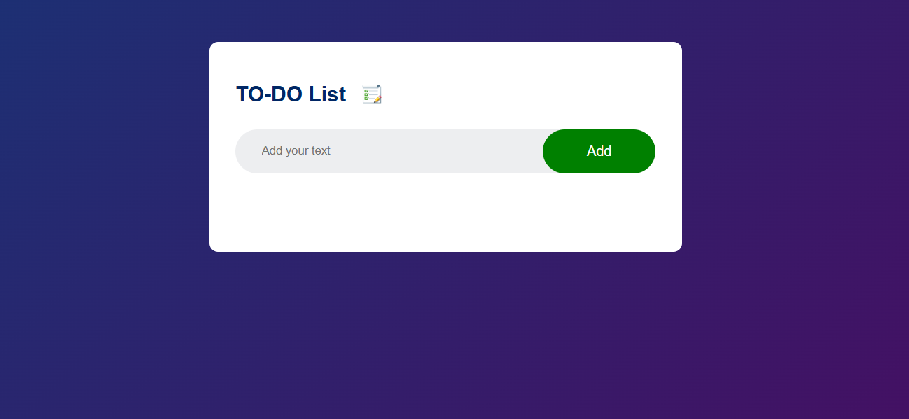

# 📝 To-Do List App

A simple and responsive To-Do List application built using **HTML, CSS, and JavaScript**.  
This project allows users to add, delete, and manage daily tasks easily.

## 🚀 Live Demo

   https://gulfamkhan77309.github.io/TO-DO-List/

   https://to-do-list-ten-tau-32.vercel.app/

---

## 📌 Features

- ➕ Add new tasks
- ✅ Mark tasks as completed
- ❌ Delete tasks
- 📱 Responsive design
- 💾 Data stored in Local Storage

---

## 🛠️ Technologies Used

- HTML5
- CSS3
- JavaScript (DOM Manipulation)
- Local Storage

---

## 📷 Screenshot

---

## 👨‍💻 Author

**Gulfam Khan**  
Frontend Developer | HTML • CSS • JavaScript 🚀

📫 Contact: gulfamkhan77309@gmail.com
